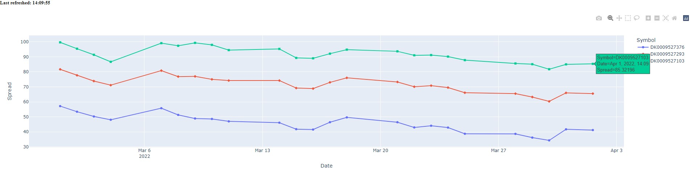
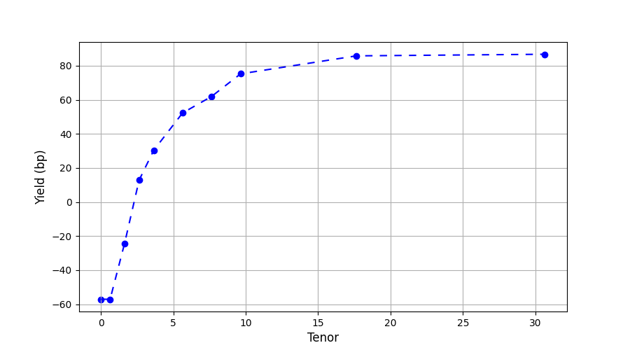
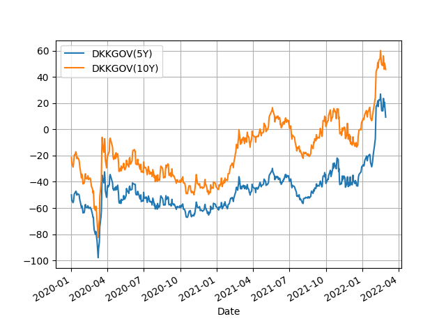
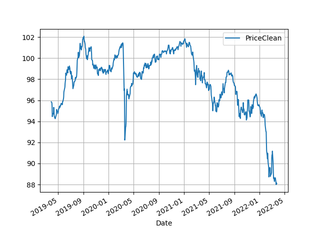
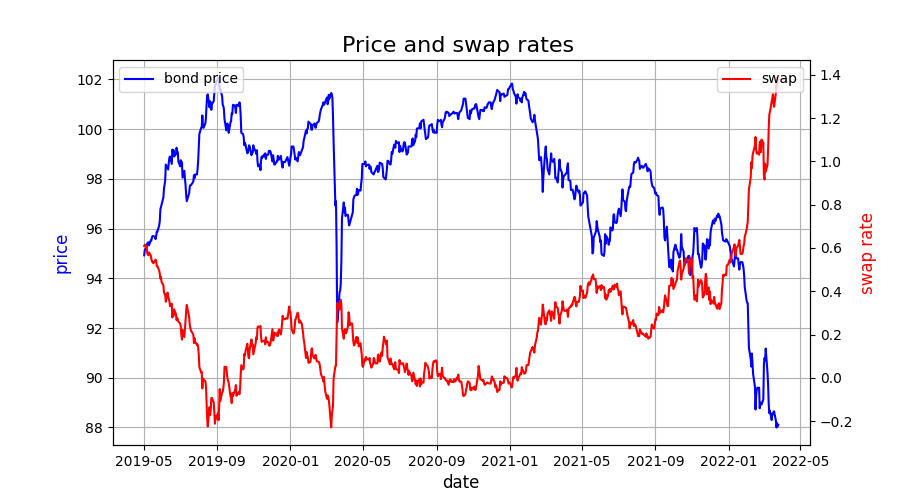
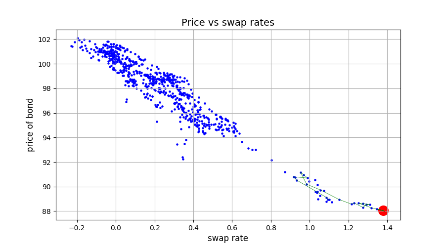
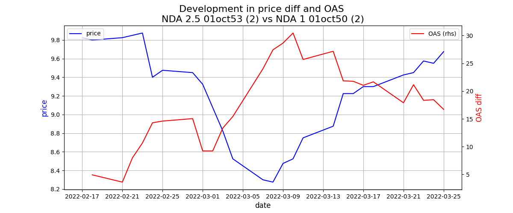

Get started with Nordea Analytics python
=========================================

Install
-----------
Run: `pip install nordea-analytics`

Note that in order to retrieve data from the package, access is required and python 3.9 or newer.

Start coding with Nordea Analytics python
------------------------------------------

All methods available in the Nordea Analytics python can be retrieved through the
get_nordea_analytics_client class.

.. code-block:: python

    from nordea_analytics import get_nordea_analytics_client

Available methods
^^^^^^^^^^^^^^^^^^^^
All methods can return results in the form of a dictionary(default) or as a pandas DataFrame(as_df=True).

From get_nordea_analytics_client:

* :meth:`calculate_bond_key_figure() <nordea_analytics.nordea_analytics_service.NordeaAnalyticsService.calculate_bond_key_figure>`.
* :meth:`calculate_horizon_bond_key_figure() <nordea_analytics.nordea_analytics_service.NordeaAnalyticsService.calculate_horizon_bond_key_figure>`.
* :meth:`get_bond_key_figures() <nordea_analytics.nordea_analytics_service.NordeaAnalyticsService.get_bond_key_figures>`.
* :meth:`get_bond_live_key_figures() <nordea_analytics.nordea_analytics_service.NordeaAnalyticsLiveService.get_bond_live_key_figures>`.
* :meth:`get_curve() <nordea_analytics.nordea_analytics_service.NordeaAnalyticsService.get_curve>`.
* :meth:`get_curve_definition() <nordea_analytics.nordea_analytics_service.NordeaAnalyticsService.get_curve_definition>`.
* :meth:`get_curve_time_series() <nordea_analytics.nordea_analytics_service.NordeaAnalyticsService.get_curve_time_series>`.
* :meth:`get_fx_forecasts() <nordea_analytics.nordea_analytics_service.NordeaAnalyticsService.get_fx_forecasts>`.
* :meth:`get_index_composition() <nordea_analytics.nordea_analytics_service.NordeaAnalyticsService.get_index_composition>`.
* :meth:`get_shift_days() <nordea_analytics.nordea_analytics_service.NordeaAnalyticsService.get_shift_days>`.
* :meth:`get_time_series() <nordea_analytics.nordea_analytics_service.NordeaAnalyticsService.get_time_series>`.
* :meth:`get_year_fraction() <nordea_analytics.nordea_analytics_service.NordeaAnalyticsService.get_year_fractionget_year_fraction>`.
* :meth:`get_yield_forecasts() <nordea_analytics.nordea_analytics_service.NordeaAnalyticsService.get_yield_forecasts>`.
* :meth:`search_bonds() <nordea_analytics.nordea_analytics_service.NordeaAnalyticsService.search_bonds>`

Enumeration classes for input parameters
^^^^^^^^^^^^^^^^^^^^^^^^^^^^^^^^^^^^^^^^^^
Many input parameters are controlled by enumeration classes. From `nordea_analytics` the following are available:

For keyfigures

* :meth:`BondKeyFigureName <nordea_analytics.key_figure_names.BondKeyFigureName>`
* :meth:`TimeSeriesKeyFigureName <nordea_analytics.key_figure_names.TimeSeriesKeyFigureName>`
* :meth:`CalculatedBondKeyFigureName <nordea_analytics.key_figure_names.CalculatedBondKeyFigureName>`
* :meth:`HorizonCalculatedBondKeyFigureName <nordea_analytics.key_figure_names.HorizonCalculatedBondKeyFigureName>`
* :meth:`LiveBondKeyFigureName <nordea_analytics.key_figure_names.LiveBondKeyFigureName>`

For curves

* :meth:`CurveName <nordea_analytics.curve_variable_names.CurveName>` Note, availability not limited to list
* :meth:`CurveDefinitionNamee <nordea_analytics.curve_variable_names.CurveDefinitionName>` Note, availability not limited to list
* :meth:`CurveType <nordea_analytics.curve_variable_names.CurveType>`
* :meth:`TimeConvention <nordea_analytics.curve_variable_names.TimeConvention>`
* :meth:`SpotForward <nordea_analytics.curve_variable_names.SpotForward>`

For bond searching

* :meth:`AmortisationType <nordea_analytics.search_bond_names.AmortisationType>`
* :meth:`AssetType <nordea_analytics.search_bond_names.AssetType>`
* :meth:`CapitalCentres <nordea_analytics.search_bond_names.CapitalCentres>`
* :meth:`CapitalCentreTypes <nordea_analytics.search_bond_names.CapitalCentreTypes>`
* :meth:`Issuers <nordea_analytics.search_bond_names.Issuers>` Note, availability not limited to list

For forecasts

* :meth:`YieldCountry <nordea_analytics.forecast_names.YieldCountry>`
* :meth:`YieldType <nordea_analytics.forecast_names.YieldType>`
* :meth:`YieldHorizon <nordea_analytics.forecast_names.YieldHorizon>`

Basic examples
---------------
Calculate Bond Key Figure
^^^^^^^^^^^^^^^^^^^^^^^^^^^
The following example calculates the spread and bpv for the ISIN `DK0002000421` at 15th of January 2021.
The returned DataFrame shows results for both given discount curves, `DKKSWAP Disc OIS` and `DKKSWAP Libor`, where they
are shifted up by 5 bps on the 6M, 1Y and 2Y tenor.

.. code-block:: python

    import datetime
    from nordea_analytics import get_nordea_analytics_client
    from nordea_analytics import CalculatedBondKeyFigureName, CurveName

    na_service = get_nordea_analytics_client(client_id="Your client id", client_secret="Your client secret")
    isin = 'DK0002000421'
    bond_key_figure = [CalculatedBondKeyFigureName.Spread, CalculatedBondKeyFigureName.BPV]
    calc_date = datetime.datetime(2021, 12, 15)
    curves = [CurveName.DKKSWAP_Disc_OIS,
              CurveName.DKKSWAP_Libor] #Optional
    rates_shifts = ["6M 5", "1Y 5", "2Y 5"] #Optional
    df = na_service.calculate_bond_key_figure(isin,
                                              bond_key_figure,
                                              calc_date,
                                              curves=curves,
                                              rates_shifts=rates_shifts,
                                              as_df=True)

Other optional input variables can be found in :meth:`calculate_bond_key_figure()
<nordea_analytics.nordea_analytics_service.NordeaAnalyticsService.calculate_bond_key_figure>`

Calculate Horizon Bond Key Figure
^^^^^^^^^^^^^^^^^^^^^^^^^^^^^^^^^^^^^
The following example calculates the BPV, CVX, Spread and Clean Price for the future date 18th of February 2022, given information
at 14th of February 2022 for the ISIN `DK0002000421`. Key figure "PriceClean" shows the clean price at
14th of February 2022.

.. code-block:: python

    import datetime
    from nordea_analytics import get_nordea_analytics_client
    from nordea_analytics import HorizonCalculatedBondKeyFigureName

    na_service = get_nordea_analytics_client(client_id="Your client id", client_secret="Your client secret")
    isin = 'DK0002000421'
    bond_key_figure = [HorizonCalculatedBondKeyFigureName.BPV, HorizonCalculatedBondKeyFigureName.CVX,
               HorizonCalculatedBondKeyFigureName.Spread, HorizonCalculatedBondKeyFigureName.PriceClean]
    calc_date = datetime.datetime(2022, 2, 14)
    horizon_date = datetime.datetime(2022, 2, 18)
    df = na_service.calculate_horizon_bond_key_figure(isin,
                                                      bond_key_figure,
                                                      calc_date,
                                                      horizon_date,
                                                      as_df=True)

Other optional input variables can be found in :meth:`calculate_horizon_bond_key_figure()
<nordea_analytics.nordea_analytics_service.NordeaAnalyticsService.calculate_horizon_bond_key_figure>`

Get Bond Key Figures
^^^^^^^^^^^^^^^^^^^^^
The following example retrieves Vega, BPV and CVX for a given set of ISINs and returns the results in a pandas DataFrame.

.. code-block:: python

    import datetime
    from nordea_analytics import get_nordea_analytics_client
    from nordea_analytics import BondKeyFigureName

    na_service = get_nordea_analytics_client(client_id="Your client id", client_secret="Your client secret")
    value_date = datetime.datetime.today() - datetime.timedelta(1)
    isins =['DK0002000421', 'DK0002004092', 'DK0002013408', 'DK0006344171']
    bond_key_figure_name = [BondKeyFigureName.Vega, BondKeyFigureName.BPV, BondKeyFigureName.CVX]

    bond_key_figures = na_service.get_bond_key_figures(isins,
                                                       bond_key_figure_name,
                                                       value_date,
                                                       as_df=True)

Get Curve
^^^^^^^^^
The following example retrieves the `DKKSWAP Libor` spot par curve with for the value date
3rd of January 20222 and returns the results in a pandas DataFrame.

.. code-block:: python

    import datetime
    from nordea_analytics import get_nordea_analytics_client
    from nordea_analytics import CurveName

    na_service = get_nordea_analytics_client(client_id="Your client id", client_secret="Your client secret")
    calc_date = datetime.datetime(2022, 1, 3)
    curve_name = CurveName.DKKSWAP_Libor

    curve = na_service.get_curve(curve_name,
                                 calc_date,
                                 as_df=True)

The following example retrieves the `USDGOV` 2Y forward curve with a half-year tenor interval (0.5) for the value date
1st January 2021 and returns the results in a pandas DataFrame. The curve is constructed using the
Nelson Siegel method and time convention Act/365.

.. code-block:: python

    import datetime
    from nordea_analytics import get_nordea_analytics_client
    from nordea_analytics import CurveName, CurveType, TimeConvention, SpotForward

    na_service = get_nordea_analytics_client(client_id="Your client id", client_secret="Your client secret")
    value_date = datetime.datetime(2021, 1, 4)
    curve_name = CurveName.USDGOV
    curve_type = CurveType.NelsonSiegel
    tenor_frequency = 0.5
    time_convention = TimeConvention.Act365
    spot_forward = SpotForward.Forward
    forward_tenor = 2

    curve = na_service.get_curve(curve_name,
                                 value_date,
                                 curve_type=curve_type,
                                 tenor_frequency=tenor_frequency,
                                 time_convention=time_convention,
                                 spot_forward=spot_forward,
                                 forward_tenor=forward_tenor,
                                 as_df=True)

Note that tenor frequency input will not have affect unless a specific curve_type are chosen like Nelson or Hybrid.

Get Curve Definition
^^^^^^^^^^^^^^^^^^^^
The following example shows the curve definition (bonds, quotes, weights and maturities contributing
to the curve) of the `EURGOV` curve for the value date of 1st of January 2021. Note, it is limited for what curves the
curve definition can be retrieved, therefore we have a special enumeration class; CurveDefinitionName.

.. code-block:: python

    import datetime
    from nordea_analytics import get_nordea_analytics_client
    from nordea_analytics import CurveDefinitionName

    na_service = get_nordea_analytics_client(client_id="Your client id", client_secret="Your client secret")
    calc_date = datetime.datetime(2021, 1, 5)
    curve_name = CurveDefinitionName.EURGOV

    curve_def = na_service.get_curve_definition(curve_name,
                                                calc_date,
                                                as_df=True)

Get Curve Time Series
^^^^^^^^^^^^^^^^^^^^^^
The following example retrieves daily points on the 0.5Y and 1Y `DKKSWAP` spot par curve for the time period 1st of
January 2021 to the day to day and returns the results in a pandas DataFrame. The curve is constructed using time
convention 30/360.

.. code-block:: python

    import datetime
    from nordea_analytics import get_nordea_analytics_client
    from nordea_analytics import CurveName, CurveType, TimeConvention

    na_service = get_nordea_analytics_client(client_id="Your client id", client_secret="Your client secret")
    from_date = datetime.datetime(2021, 1, 1)
    to_date = datetime.datetime.today()
    curve = CurveName.DKKSWAP
    tenors = [1, 0.5]  # at least one required.
    curve_type = CurveType.ParCurve  # Optional input
    time_convention = TimeConvention.TC_30360  # Optional input

    curve_time_series = na_service.get_curve_time_series(curve,
                                                         from_date,
                                                         to_date,
                                                         tenors,
                                                         curve_type=curve_type,
                                                         time_convention=time_convention,
                                                         as_df=True)

The following example retrieves daily points on the 2Y1Y `EURGOV` forward curve, for the time period 3rd of
January 2021 to the day to day and returns the results in a pandas DataFrame. The curve is constructed using the
bootstrap method time convention 30/360. Note, when forward or implied forward curves are retrieved, a forward tenor
has to be given.

.. code-block:: python

    import datetime
    from nordea_analytics import get_nordea_analytics_client
    from nordea_analytics import CurveName,  CurveType, TimeConvention, SpotForward

    na_service = get_nordea_analytics_client(client_id="Your client id", client_secret="Your client secret")
    from_date = datetime.datetime(2022, 1, 3)
    to_date = datetime.datetime.today()
    curve = CurveName.DKKGOV
    tenors = 1
    curve_type = CurveType.Bootstrap  # Optional input
    time_convention = TimeConvention.Act365  # Optional input
    spot_forward = SpotForward.Forward  # Optional input
    forward_tenor = 2  # Required when spot_forward is set to spot forward or implied forward curve.

    curve_time_series = na_service.get_curve_time_series(curve,
                                                         from_date,
                                                         to_date,
                                                          tenors,
                                                         curve_type=curve_type,
                                                         time_convention=time_convention,
                                                         spot_forward=spot_forward,
                                                         forward_tenor=forward_tenor,
                                                         as_df=True)

Get FX Forecast
^^^^^^^^^^^^^^^^
The following example retrieves Nordea's latest FX forecast for the EUR/DKK cross currency pair.

.. code-block:: python

    from nordea_analytics import get_nordea_analytics_client

    na_service = get_nordea_analytics_client(client_id="Your client id", client_secret="Your client secret")
    currency_pair = "EURDKK"

    df = na_service.get_fx_forecasts(currency_pair, as_df=True)

Get Index Composition
^^^^^^^^^^^^^^^^^^^^^^
The following example retrieves index composition for a set of Indices for the value date yesterday, and returns the result
in a pandas DataFrame.

.. code-block:: python

    import datetime
    from nordea_analytics import get_nordea_analytics_client

    na_service = get_nordea_analytics_client(client_id="Your client id", client_secret="Your client secret")
    calc_date = datetime.datetime.today() - datetime.timedelta(1)
    indices = ['DK Mtg Callable', 'DK Govt']

    index_composition = na_service.get_index_composition(indices,
                                                         calc_date,
                                                         as_df=True)

Get Live Key Figure
^^^^^^^^^^^^^^^^^^^^^^
The following example returns live Quote and CVX in a pandas DataFrame format and stops the feed after one minute.

.. code-block:: python

    import time
    from nordea_analytics import get_nordea_analytics_client
    from nordea_analytics import LiveBondKeyFigureName

    na_service = get_nordea_analytics_client(client_id="Your client id", client_secret="Your client secret")
    live_bond_keyfigure = na_service.iter_live_bond_key_figures(["DK0009398620"],
                                                             [LiveBondKeyFigureName.Quote,
                                                             LiveBondKeyFigureName.CVX],
                                                             as_df=True)
    t_end = time.time() + 60 * 1  #one minute

    for keyfigures in live_bond_keyfigure:
        df = keyfigures
        print(df)
        if time.time() > t_end:
            live_bond_keyfigure.stop()

Get Live Key Figure Snapshot
^^^^^^^^^^^^^^^^^^^^^^
The following example returns the latest available live Quote and CVX in a pandas DataFrame format.

.. code-block:: python

    import time
    from nordea_analytics import get_nordea_analytics_client
    from nordea_analytics import LiveBondKeyFigureName

    na_service = get_nordea_analytics_client(client_id="Your client id", client_secret="Your client secret")
    live_bond_keyfigure = na_service.iter_live_bond_key_figures(["DK0009398620"],
                                                             [LiveBondKeyFigureName.Quote,
                                                             LiveBondKeyFigureName.CVX],
                                                             as_df=True)
    t_end = time.time() + 60 * 1  #one minute

    for kf in live_bond_keyfigure:
        df = kf
        print(df)
        if time.time() > t_end:
            live_bond_keyfigure.stop()

Get Live Key Figure Snapshot
^^^^^^^^^^^^^^^^^^^^^^
The following example returns the latest available live Quote and CVX in a pandas DataFrame format.

.. code-block:: python

    import time
    from nordea_analytics import get_nordea_analytics_client
    from nordea_analytics import LiveBondKeyFigureName

    na_service = get_nordea_analytics_client(client_id="Your client id", client_secret="Your client secret")
    latest_bond_keyfigures = na_service.get_bond_live_key_figures(["DK0009398620"],
                                              [LiveBondKeyFigureName.Quote,
                                              LiveBondKeyFigureName.CVX],
                                              as_df=True)

Get Time Series
^^^^^^^^^^^^^^^^
The following example retrieves daily Vega, BPV and Convexity for a given set of ISINs for the time period 1st of
January 2021 to the day to day and returns the results in a python dictionary. The
:meth:`get_time_series() <nordea_analytics.nordea_analytics_service.NordeaAnalyticsService.get_time_series>` function
can also retrieve time series for swaps, FX, FX swap point, then the key figure name should be `TimeSeriesKeyFigureName.Quote`.

.. code-block:: python

    import datetime
    from nordea_analytics import get_nordea_analytics_client
    from nordea_analytics import TimeSeriesKeyFigureName

    na_service = get_nordea_analytics_client(client_id="Your client id", client_secret="Your client secret")
    from_date = datetime.datetime(2021, 1, 1)
    to_date = datetime.datetime.today()
    symbols = ['DK0002000421', 'DK0002004092', 'DK0002013408', 'DK0006344171']
    key_figure_name = [TimeSeriesKeyFigureName.Vega,
                       TimeSeriesKeyFigureName.BPV,
                       TimeSeriesKeyFigureName.CVX]

    time_series = na_service.get_time_series(symbols,
                                             key_figure_name,
                                             from_date,
                                             to_date,
                                             as_df=True)

Get Shift Days
^^^^^^^^^^^^^^^^^^^^^
The following example shifts a date forward 1 bank day and returns the results as a datetime.

.. code-block:: python

    import datetime
    from nordea_analytics import get_nordea_analytics_client
    from nordea_analytics import DateRollConvention, DayCountConvention, Exchange

    na_service = get_nordea_analytics_client(client_id="Your client id", client_secret="Your client secret")
    date = datetime.date(2022, 3, 18)
    day_count_convention = DayCountConvention.BankDays
    date_roll_convention = DateRollConvention.Preceeding
    exchange = Exchange.Copenhagen

    shifted_date = na_service.get_shift_days(date,
                                             1,
                                             exchange=exchange,
                                             day_count_convention=day_count_convention,
                                             date_roll_convention=date_roll_convention)

Get Yield Forecast
^^^^^^^^^^^^^^^^^^^^
The following retrieves Nordea's latest yield forecast for CIBOR 3M

.. code-block:: python

    from nordea_analytics import get_nordea_analytics_client
    from nordea_analytics import YieldCountry, YieldHorizon, YieldType

    na_service = get_nordea_analytics_client(client_id="Your client id", client_secret="Your client secret")

    df = na_service.get_yield_forecasts(YieldCountry.DK,
                                        YieldType.Libor,
                                        YieldHorizon.Horizon_3M,
                                        as_df=True)

Get Year Fraction
^^^^^^^^^^^^^^^^^^^^^
The following example calculates the time between two dates as a year fraction and returns the result as double.

.. code-block:: python

    import datetime
    from nordea_analytics import get_nordea_analytics_client
    from nordea_analytics import TimeConvention

    na_service = get_nordea_analytics_client(client_id="Your client id", client_secret="Your client secret")
    from_date = datetime.date(2022, 3, 18)
    to_date = datetime.date(2022, 6, 18)
    time_convention = TimeConvention.Act365

    year_fraction = na_service.get_year_fraction(from_date,
                                                 to_date,
                                                 time_convention)

Search Bonds
^^^^^^^^^^^^^
The search_bonds() function requires at least one search criteria.
The following example returns list of ISINs and bond names for USD Fixed to Float Bond with annuity as amortisation
type. The results are in a DataFrame format.

.. code-block:: python

    from nordea_analytics import get_nordea_analytics_client
    from nordea_analytics import AssetType, AmortisationType

    na_service = get_nordea_analytics_client(client_id="Your client id", client_secret="Your client secret")
    currency = "USD"
    asset_type = AssetType.FixToFloatBond
    amortisation_type = AmortisationType.Annuity

    df = na_service.search_bonds(currency=currency,
                                 asset_types=asset_type,
                                 amortisation_type=amortisation_type,
                                 as_df=True)

The following example returns list of ISINs and bond names for `only` Danish Mortgage Bonds (dmb=True), with DKK as currency and maturity between 9th
of December 2021 to the day to day. Note that if dmb=False (default value), it would return `all` bonds with the same criteria,
including Danish Mortgage Bonds. The results are in a DataFrame format.

.. code-block:: python

    import datetime
    from nordea_analytics import get_nordea_analytics_client

    na_service = get_nordea_analytics_client(client_id="Your client id", client_secret="Your client secret")
    from_maturity = datetime.datetime(2021, 12, 9)
    to_maturity = datetime.datetime.today()
    currency = "DKK"

    df = na_service.search_bonds(dmb=True,
                                 currency=currency,
                                 upper_maturity=to_maturity,
                                 lower_maturity=from_maturity,
                                 as_df=True)

When asset_type is set to Danish Capped Floaters, then both capped floaters and normal floaters are returned.
To search specifically for capped floaters set upper_coupon = 1,000 (shown in example below).
To search specifically for normal floaters set lower_coupon = 100,000.

.. code-block:: python

    from nordea_analytics import get_nordea_analytics_client
    from nordea_analytics import AssetType

    na_service = get_nordea_analytics_client(client_id="Your client id", client_secret="Your client secret")
    asset_type = AssetType.DanishCappedFloaters
    upper_coupon = 1000

    currency = "DKK"

    df = na_service.search_bonds(dmb=True,
                                 currency=currency,
                                 asset_types=asset_type,
                                 upper_coupon=upper_coupon,
                                 as_df=True)

Other serach criterias are listed in :meth:`search_bonds()
<nordea_analytics.nordea_analytics_service.NordeaAnalyticsService.search_bonds>`

Advanced examples
-------------------

Live Dash board
^^^^^^^^^^^^^^^^^^^
.. code-block:: python

    from datetime import datetime
    from dash import Dash, dash_table
    from dash.dependencies import Input, Output
    from dash import html
    from dash import dcc

    from nordea_analytics import get_nordea_analytics_client
    from nordea_analytics import LiveBondKeyFigureName

    na_service = get_nordea_analytics_client(client_id="Your client id", client_secret="Your client secret")
    isins = ["DK0009398620", "DK0009922320","DK0009924029"]
    keyfigures = [LiveBondKeyFigureName.Quote, LiveBondKeyFigureName.Spread]

    df = na_service.get_bond_live_key_figures(isins,
                                                keyfigures,
                                                as_df=True)
    app = Dash(__name__)
    app.layout = html.Div([
        dcc.Interval(
            id='graph-update',
            interval=1000
        ),
        html.H5(children=f'Last refreshed:', id='header'),
        dash_table.DataTable(data=df.to_dict(orient='records'),
                             columns=[{"name": i, "id": i} for i in df.columns],
                             id='table',
                             )
    ])

    @app.callback(
        [
            Output(component_id='table', component_property='data'),
            Output(component_id='table', component_property='columns'),
            Output(component_id='header', component_property='children'),
        ],
        [
            Input(component_id='graph-update', component_property='n_intervals')
        ]
    )
    def update_table(n_interval):
        df_data = na_service.get_bond_live_key_figures(isins,
                                                         keyfigures,
                                                         as_df=True)
        return df_data.to_dict(orient='records'), \
               [{"name": i, "id": i} for i in df_data.columns], \
               f'Last refreshed: {datetime.now().strftime("%H:%M:%S")}'

    def main():
        app.run_server(debug=False)

    if __name__ == '__main__':
        main()

Live Time Series Plot
^^^^^^^^^^^^^^^^^^^^^^^
Live plot with the time series for Spread from 1st of March 2022 to the most recent live value. The graph updates
when new live key figures are in.

.. code-block:: python

    from datetime import datetime, timedelta
    from dash import Dash
    from dash.dependencies import Input, Output
    from dash import html
    from dash import dcc
    import plotly.express as px

    from nordea_analytics import get_nordea_analytics_client
    from nordea_analytics import TimeSeriesKeyFigureName as kf_ts
    from nordea_analytics import LiveBondKeyFigureName as kf_live

    na_service = get_nordea_analytics_client(client_id="Your client id", client_secret="Your client secret")
    from_date = datetime(2022, 3, 1)
    yesterday = datetime.today() - timedelta(1)
    key_figure_name_ts = [kf_ts.Spread]
    key_figure_name_live = [kf_live.Spread]

    isin = ["DK0009527376", "DK0009527293", "DK0009924029"]

    time_Series = na_service.get_time_series(isin,
                                                key_figure_name_ts,
                                                from_date,
                                                yesterday,
                                                as_df=True)

    app = Dash(__name__)

    app.layout = html.Div([
    dcc.Interval(
        id='graph-update',
        interval=1000),
    html.H5(children=f'Last refreshed:', id='header'),
    dcc.Graph(id="graph"),
    ])

    @app.callback(
        Output("graph", "figure"),
        Output(component_id='header', component_property='children'),
        Input(component_id='graph-update', component_property='n_intervals'))
    def update_bar_chart(n_interval):
        live_df = na_service.get_bond_live_key_figures(isin,
                                                          key_figure_name_live,
                                                          as_df=True)
        live_df = live_df.rename(columns={"timestamp": "Date", "ISIN": "Symbol"})
        df = time_Series.append(live_df)
        fig = px.line(df, x="Date", y="Spread", symbol="Symbol", color="Symbol")
        return fig, f'Last refreshed: {datetime.now().strftime("%H:%M:%S")}'

    app.run_server(debug=False)

Make key figure report on portfolio or index (or both)
^^^^^^^^^^^^^^^^^^^^^^^^^^^^^^^^^^^^^^^^^^^^^^^^^^^^^^^
.. code-block:: python

    import pandas as pd
    from datetime import datetime
    from nordea_analytics import get_nordea_analytics_client
    from nordea_analytics import BondKeyFigureName

    na_service = get_nordea_analytics_client(client_id="Your client id", client_secret="Your client secret")
    df_index = na_service.get_index_composition("DK0IX0000014", datetime(2022, 2, 28),
                                                    as_df=True).set_index('ISIN')

    df_key_fig = na_service.get_bond_key_figures(symbols=df_index.index,
                                                    calc_date=datetime(2022, 2, 28),
                                                    keyfigures=[BondKeyFigureName.BPV, BondKeyFigureName.CVX],
                                                    as_df=True)

    df_kf_report = pd.concat([df_index, df_key_fig], axis=1)

    print(f"BPV is {(df_kf_report['Nominal Weight'] * df_kf_report['BPV']).sum()}")
    print(f"CVX is {(df_kf_report['Nominal Weight'] * df_kf_report['CVX']).sum()}")

Plot Curve
^^^^^^^^^^^^^
.. code-block:: python

    import matplotlib.pyplot as plt
    from datetime import datetime
    from nordea_analytics import get_nordea_analytics_client
    from nordea_analytics import CurveType, TimeConvention, SpotForward, CurveName

    na_service = get_nordea_analytics_client(client_id="Your client id", client_secret="Your client secret")

    df = na_service.get_curve(curve=CurveName.DKKGOV,
                                 calc_date=datetime.now(),
                                 curve_type=CurveType.YTMCurve,
                                 time_convention=TimeConvention.Act365,
                                 spot_forward=SpotForward.Spot,
                                 tenor_frequency=1,
                                 as_df=True)

    f, ax = plt.subplots(figsize=(9,5))
    ax.plot(df['Tenor'], df['Value'].mul(10_000), color='blue', dashes=(5,5))
    ax.scatter(df['Tenor'], df['Value'].mul(10_000), color='blue')
    ax.set_xlabel("Tenor", fontsize=12)
    ax.set_ylabel(f"Yield (bp)", fontsize=12)
    ax.grid()
    plt.show()

Plot Curve Time series
^^^^^^^^^^^^^^^^^^^^^^^
.. code-block:: python

    import matplotlib.pyplot as plt
    from datetime import datetime
    from nordea_analytics import get_nordea_analytics_client
    from nordea_analytics import CurveType, TimeConvention, SpotForward, CurveName

    na_service = get_nordea_analytics_client(client_id="Your client id", client_secret="Your client secret")
    na_service.get_curve_time_series(curves=CurveName.DKKGOV,
                                        from_date=datetime(2020, 1, 2),
                                        to_date=datetime(2022, 2, 28),
                                        curve_type=CurveType.YTMCurve,
                                        time_convention=TimeConvention.Act365, tenors=[5, 10],
                                        spot_forward=SpotForward.Spot,
                                        as_df=True).set_index('Date').mul(10_000).plot(grid=True)
    plt.show()

Plot time series key figure
^^^^^^^^^^^^^^^^^^^^^^^^^^^^
.. code-block:: python

    import matplotlib.pyplot as plt
    from datetime import datetime
    from nordea_analytics import get_nordea_analytics_client
    from nordea_analytics import TimeSeriesKeyFigureName as kf_ts

    na_service = get_nordea_analytics_client(client_id="Your client id", client_secret="Your client secret")
    na_service.get_time_series(symbols=["NDA 1 01oct50 (2)"],
                                  keyfigures=[kf_ts.PriceClean],
                                  from_date=datetime(2019, 1, 2),
                                  to_date=datetime.now(),
                                  as_df=True).set_index('Date').plot(grid=True)
    plt.show()

Plot time series key figure with crispy charts
^^^^^^^^^^^^^^^^^^^^^^^^^^^^^^^^^^^^^^^^^^^^^^^^^
.. code-block:: python

    import pandas as pd
    import matplotlib.pyplot as plt
    from datetime import datetime

    from nordea_analytics import get_nordea_analytics_client
    from nordea_analytics import TimeSeriesKeyFigureName as kf_ts

    na_service = get_nordea_analytics_client(client_id="Your client id", client_secret="Your client secret")
    from_date = datetime(2019, 5, 2)

    df_swap = na_service.get_time_series(symbols=["DKK SWAP 10Y"],
                                            keyfigures=[kf_ts.Quote],
                                            from_date=from_date,
                                            to_date=datetime.now(),
                                            as_df=True).set_index('Date')

    df_price = na_service.get_time_series(symbols=["NDA 1 01oct50 (2)"],
                                            keyfigures=[kf_ts.PriceClean],
                                            from_date=from_date,
                                            to_date=datetime.now(),
                                            as_df=True).set_index('Date')

    f, ax = plt.subplots(figsize=(9,5))
    ax.plot(df_price['PriceClean'], color='blue', label="bond price")

    ax2 = ax.twinx()
    ax2.plot(df_swap['Quote'], color='red', label="swap")

    ax.set_title("Price and swap rates ", fontsize=16)
    ax.legend(loc=2)
    ax.set_xlabel("date", fontsize=12)
    ax.set_ylabel("price", fontsize=12, color='blue')
    ax2.set_ylabel("swap rate", fontsize=12, color='red')
    ax2.legend(loc=1)
    ax.grid()

    df_plot = pd.DataFrame()
    df_plot['swap'] = df_swap['Quote']
    df_plot['bond'] = df_price['PriceClean']

    df_plot = df_plot.dropna()

    f, ax = plt.subplots(figsize=(9,5))
    ax.scatter(df_plot['swap'], df_plot['bond'], color='blue', s=5)
    ax.plot(df_plot['swap'][-20:], df_plot['bond'][-20:], color='green', linewidth=0.5)
    ax.scatter(df_plot['swap'][-1], df_plot['bond'][-1], color='red', s=200)

    ax.set_title("Price vs swap rates", fontsize=14)
    ax.set_xlabel("swap rate", fontsize=12)
    ax.set_ylabel(f"price of bond", fontsize=12)
    ax2.set_ylabel("swap rate", fontsize=12)
    ax.grid()
    plt.show()

Showing why buybacks are making bonds more rich
^^^^^^^^^^^^^^^^^^^^^^^^^^^^^^^^^^^^^^^^^^^^^^^^^^
2.5%53 vs 1%50

.. code-block:: python

    import pandas as pd
    import matplotlib.pyplot as plt
    from datetime import datetime

    from nordea_analytics import get_nordea_analytics_client
    from nordea_analytics import TimeSeriesKeyFigureName as kf_ts
    from nordea_analytics import CalculatedBondKeyFigureName as kf_calc
    from nordea_analytics import CurveName

    na_service = get_nordea_analytics_client(client_id="Your client id", client_secret="Your client secret")
    from_date = datetime(2022, 1, 3)

    isin_1 = "NDA 2.5 01oct53 (2)"
    isin_2 = "NDA 1 01oct50 (2)"
    df_25_53 = na_service.get_time_series(symbols=[isin_1],
                                             keyfigures=[kf_ts.PriceClean, kf_ts.OAS_GOV],
                                             from_date=from_date,
                                             to_date=datetime.now(),
                                             as_df=True).set_index('Date')
    df_1_50 = na_service.get_time_series(symbols=[isin_2],
                                            keyfigures=[kf_ts.PriceClean, kf_ts.OAS_GOV],
                                            from_date=from_date,
                                            to_date=datetime.now(),
                                            as_df=True).set_index('Date')

    df_calc_oas = na_service.calculate_bond_key_figure(calc_date=datetime.now(),
                                                          symbols=[isin_1, isin_2],
                                                          keyfigures=[kf_calc.Spread],
                                                          curves=[CurveName.DKKGOV],
                                                          as_df=True)
    df_25_53.loc[df_25_53.index[-1], 'OAS_GOV'] = df_calc_oas.loc[isin_1, 'Spread']
    df_1_50.loc[df_25_53.index[-1], 'OAS_GOV'] = df_calc_oas.loc[isin_2, 'Spread']

    df_plot = pd.DataFrame()

    df_plot['price_diff'] = df_25_53['PriceClean'] - df_1_50['PriceClean']
    df_plot['oas_diff'] = df_25_53['OAS_GOV'] - df_1_50['OAS_GOV']

    f, ax = plt.subplots(figsize=(12, 5))
    ax.plot(df_plot['price_diff'], color='blue', label="price")

    ax2 = ax.twinx()
    ax2.plot(df_plot['oas_diff'], color='red', label="OAS (rhs)")

    ax.set_title(f"Development in price diff and OAS \n{isin_1} vs {isin_2}", fontsize=16)
    ax.legend(loc=2)
    ax.set_xlabel("date", fontsize=12)
    ax.set_ylabel("price", fontsize=12, color='blue')
    ax2.set_ylabel("OAS diff", fontsize=12, color='red')
    ax2.legend(loc=1)
    ax.grid()
    plt.show()

